参考

```
https://www.fujieace.com/penetration-test/cdn-find-ip.html
```

# 1.验证目标网络是否使用了CDN

## 1.1 ping服务

使用各种多地 ping 的服务

查看对应 IP 地址是否唯一

如果不唯一，多半是使用了CDN

多地 Ping 网站有：

```
http://ping.chinaz.com/
http://ping.aizhan.com/
http://ce.cloud.360.cn/
https://www.17ce.com/
```

### 1.1.1chinaz测试

```
http://ping.chinaz.com/
```

测试网址

```
www.exp.icu
```

发现返回的IP地址不唯一

```
104.21.37.123
172.67.208.27
2606:4700:3034::6815:257b
188.114.97.0
```

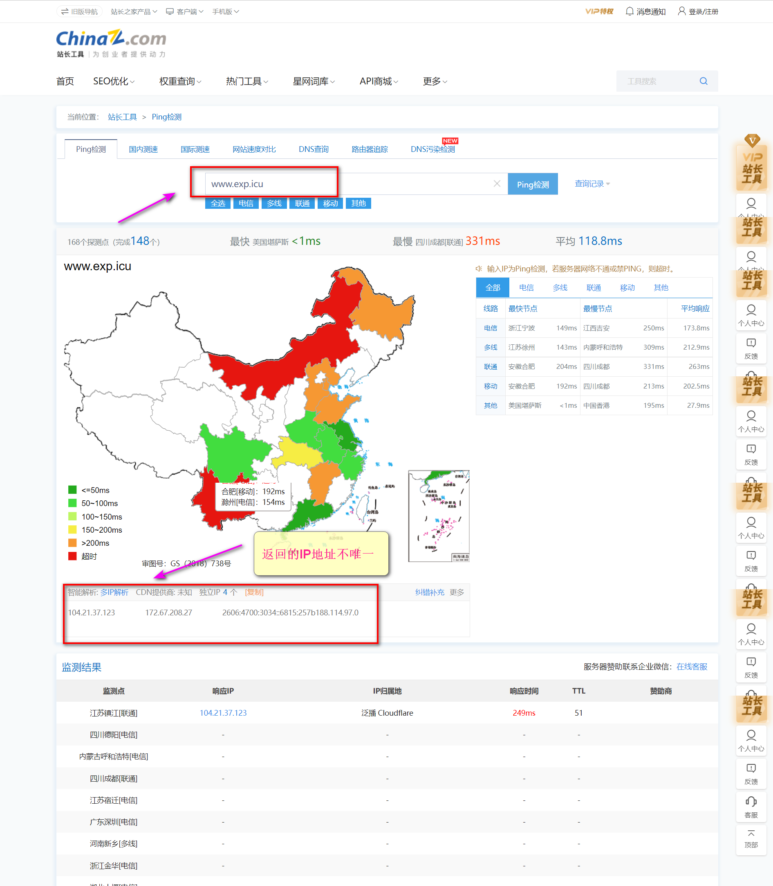


### 1.1.2 aizhan测试

```
http://ping.aizhan.com/
```

测试网址

```
www.exp.icu
```

返回两个不同的IP地址

```
172.67.208.27
104.21.37.123
```

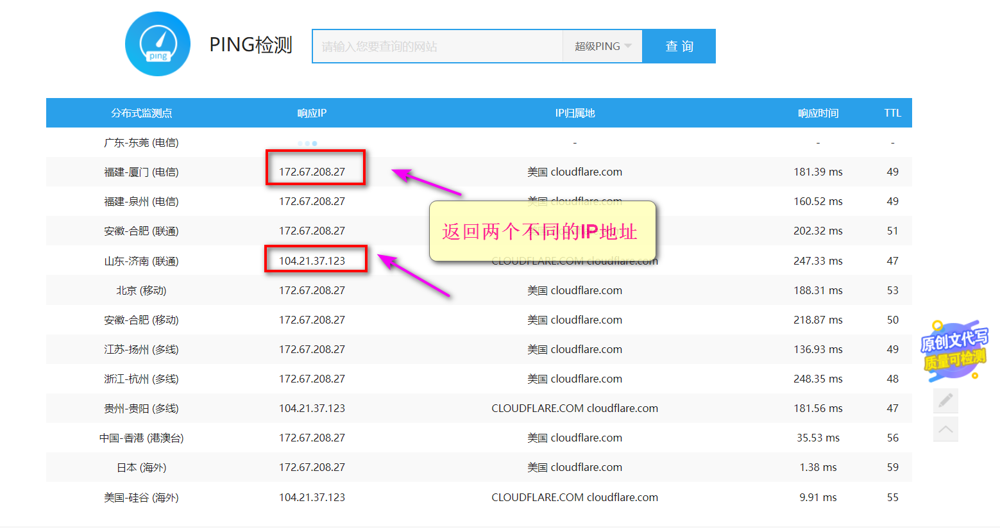

### 1.1.3 cloud测试

```
http://ce.cloud.360.cn/
```

测试网址

```
www.exp.icu
```


### 1.1.4 17ce测试

```
https://www.17ce.com/
```

测试网址

```
www.exp.icu
```

发现存在3个独立的IP地址

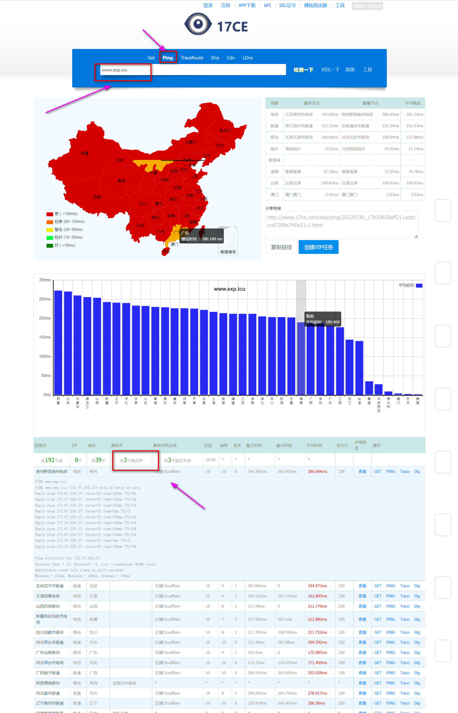


## 1.2 nslookup检测

在Windows主机上，打开CMD指令

- cmd指令打开【WIN+R】后
- 输入 **cmd** 即可进入

- 进入cmd界面，输入下列指令
- 然后再输入目标网络地址

```
nslookup
```

测试网址

```
www.exp.icu
```

试了2遍后发现返回的IP地址不同

所以该网址包含CDN服务

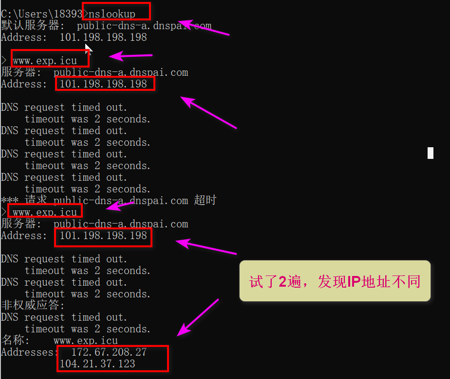

# 2.绕过CDN找真实IP

## 2.1 查询DNS历史记录

### 2.1.1 DNS缓存查询

这里主要是利用管理员疏忽

- 通过DNS缓存查询
- 查看 IP 与 域名绑定的历史记录
- 可能会存在使用 CDN 前的记录

相关查询网站有：

```
https://dnsdb.io/zh-cn/

https://x.threatbook.cn/

http://toolbar.netcraft.com/site_report?url=

http://viewdns.info/

https://tools.ipip.net/cdn.php
```

```
https://dnsdb.io/zh-cn/
```

 

```
https://x.threatbook.cn/
```


```
http://toolbar.netcraft.com/site_report?url=
```

找到一个IP地址

```
104.21.37.123
```

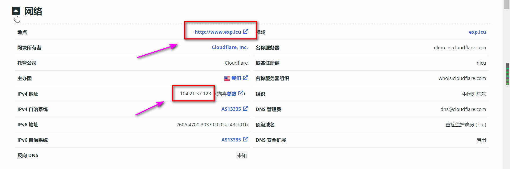

```
http://viewdns.info/
```

直接查找的IP地址

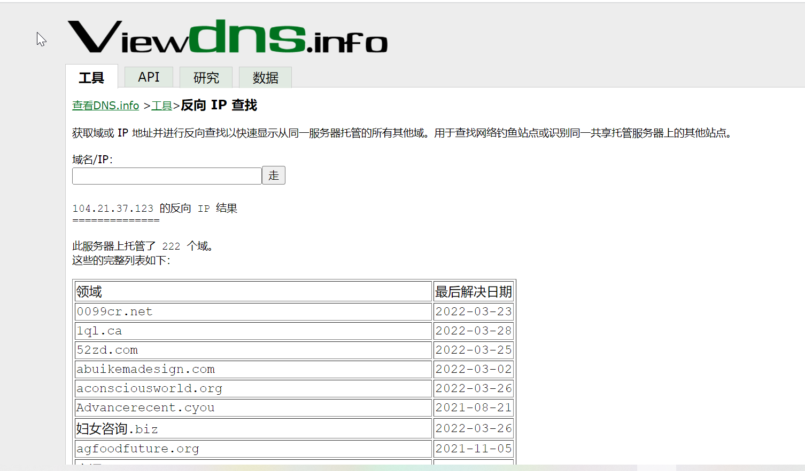

```
https://tools.ipip.net/cdn.php
```

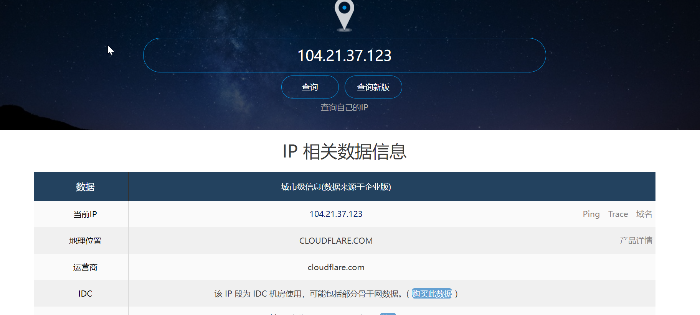

### 2.1.2利用SecurityTrails平台

```
https://securitytrails.com/
```

攻击者就可以精准的找到真实原始IP

- 只需在搜索字段中输入网站域名
- 然后按Enter键即可
- 这时“历史数据”就可以在左侧的菜单中找到

SecurityTrails平台除了过去的DNS记录

即使是当前的记录也可能泄漏原始服务器IP

**例如**

- MX记录是一种常见的查找IP的方式
  - 如果网站在与web相同的服务器和IP上托管自己的邮件服务器
  - 那么原始服务器IP将在MX记录中。

## 2.2 查询子域名

毕竟 CDN 还是不便宜的

- 所以很多站长可能只会对主站或者流量大的子站点做了 CDN
- 而很多小站子站点又跟主站在同一台服务器或者同一个C段内
- 此时就可以通过查询子域名对应的 IP 来辅助查找网站的真实IP

 

下面介绍些常用的子域名查找的方法和工具：

```
https://x.threatbook.cn/
https://dnsdb.io/zh-cn/
```

3、Google 搜索；例如：用语法"site:baidu.com -www"就能查看除www外的子域名。

4、子域名扫描器；这个我就不多说了，这种工具太多了。


## 2.3 网络空间搜索引擎

最常见的网络空间搜索引擎有钟馗之眼、shodan、fofa搜索

```
1、钟馗之眼：https://www.zoomeye.org/

2、Shodan：https://www.shodan.io/

3、FOFA：https://fofa.so/
```

这里主要是利用网站返回的内容寻找真实原始IP，如果原始服务器IP也返回了网站的内容，那么可以在网上搜索大量的相关数据。

 1、钟馗之眼

```
https://www.zoomeye.org/
```

发现一个IP地址

```
150.230.194.40
```

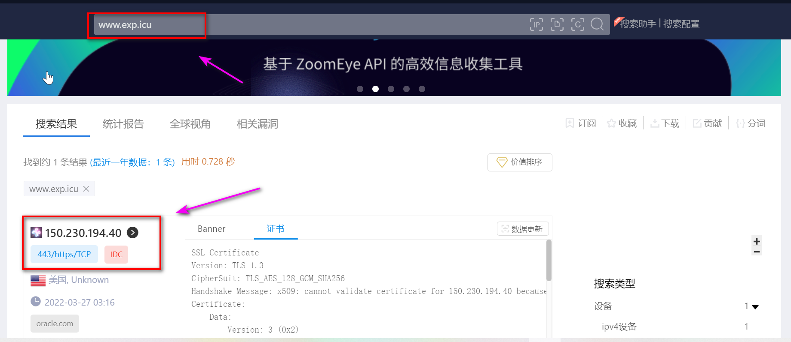

利用IP反查

发现了几个相同的IP地址

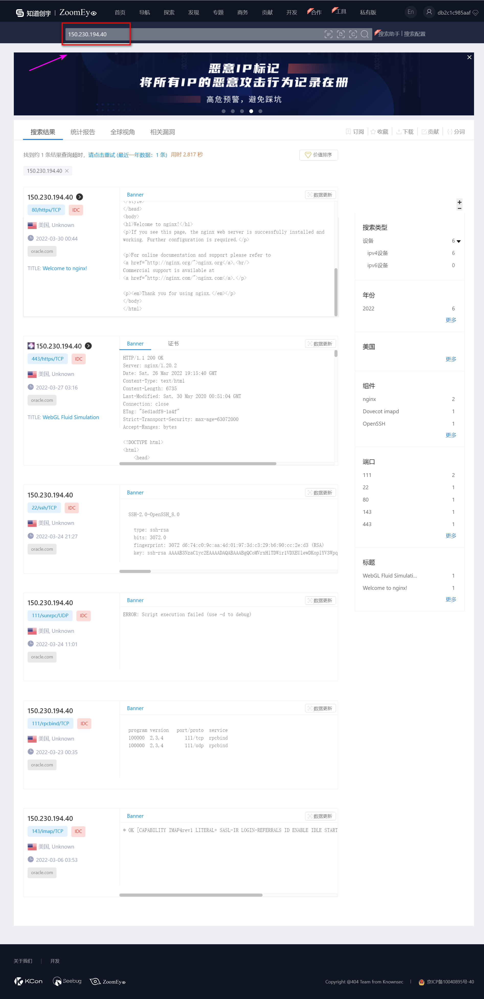

2、Shodan：

```
https://www.shodan.io/
```

搜索IP

```
150.230.194.40
```

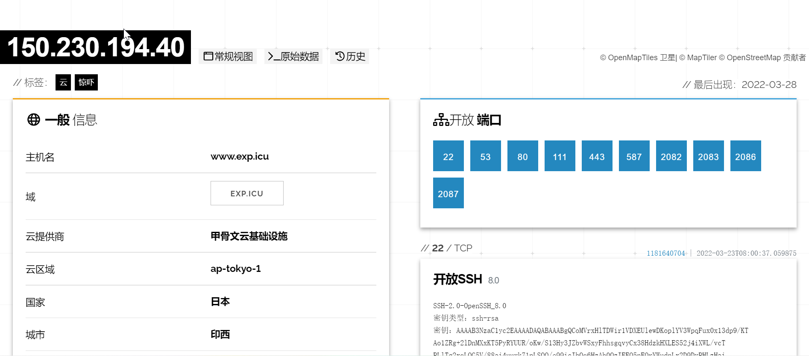

域记录如下

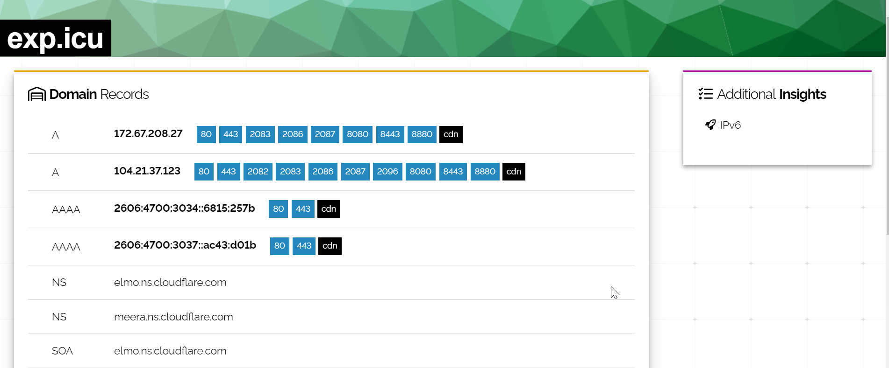

只需要浏览网站源代码，寻找独特的代码片段。

在JavaScript中使用具有访问或标识符参数的第三方服务（例如Google Analytics、reCAPTCHA、统计）是攻击者经常使用的方法。或者说用title，毕竟竟每个网站的title基本上都是独一无二的。 以fofa为例：可以直接以 title=""来搜索。

再配合最常见的网络空间搜索引擎就可以轻而易举的找到网站的真实的IP。

## 2.4 利用SSL证书寻找真实IP


## 2.5 全网扫描

